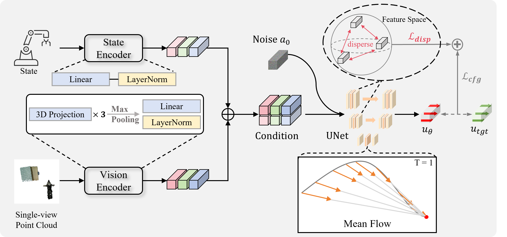

# $\textsf{\color{orange}{M}\color{orange}{P}\textcolor{orange}{1}}$: $\textsf{\color{orange}{M}}\text{ean}$ Flow Tames $\textsf{\color{orange}{P}}\text{olicy}$ Learning in $\textsf{\color{orange}{1}}$-step for Robotic Manipulation
<h4 align = "center">Juyi Sheng<sup>*</sup>, Ziyi Wang<sup>*</sup>, Peiming Li, Mengyuan Liu<sup>† </sup>
<h4 align = "center"> State Key Laboratory of General Artificial Intelligence,
Peking University, Shenzhen Graduate School, Shenzhen, China</center></h4>
<h4 align = "center"> 
  <a href="https://mp1-2254.github.io/"><strong>Project Page</strong></a>
  |
  <a href="https://arxiv.org/"><strong>arXiv</strong></a>
  
## Abstract
In robot manipulation, robot learning is becoming a prevailing approach. However, generative models within this field
face a fundamental trade-off between the slow, iterative sampling of diffusion models and the architectural constraints of
faster Flow-based methods, which often rely on explicit consistency losses. To address these limitations, we introduce
MP1, which pairs 3D point-cloud inputs with the MeanFlow paradigm to generate action trajectories in one network function evaluation (1-NFE). By directly learning the interval-averaged velocity via the “MeanFlow Identity,” our policy avoids any additional consistency constraints. This formulation eliminates numerical ODE-solver errors during inference, yielding more precise trajectories. MP1 further incorporates CFG for improved trajectory controllability while retaining 1-NFE inference without reintroducing structural constraints. Because subtle scene-context variations are critical for robot learning, especially in few-shot learning, we introduce a lightweight Dispersive Loss that repels state embeddings during training, boosting generalization without slowing inference. We validate our method on the Adroit and Meta-World benchmarks, as well as in real-world scenarios. Experimental results show MP1 achieves superior average task success rates, outperforming DP3 by 10.2% and FlowPolicy by 7.3%. Its average inference time is only 6.8 ms—19× faster than DP3 and nearly 2× faster than FlowPolicy. Our code is available at https://mp1-2254.github.io/.

## Pipeline
<div align="center">
  
</div>

Overview of MP1. The MP1 takes the historical observation point cloud and the robot's state as inputs. These inputs are processed through a visual encoder and a state encoder, respectively, and then serve as conditional inputs to the UNet-integrated MeanFlow. After passing through the MeanFlow, the model computes regression loss ($L_{cfg}$) between the mean velocity generated from the initial noise and the target velocity. This $L_{cfg}$ is combined with a Dispersive Loss ($L_{disp}$) imposed on the UNet’s hidden states to jointly optimize the network parameters.

# 💻 Installation

See [install.md](install.md) for installation instructions. 

# 📚 Data
You could generate demonstrations by yourself using our provided expert policies.  Generated demonstrations are under `$YOUR_REPO_PATH/MP1/data/`.

# 🛠️ Usage
Scripts for generating demonstrations, training, and evaluation are all provided in the `scripts/` folder. 

The results are logged by `swanlab or wandb`, so you need to `swanlab login` first to see the results.

1. Generate demonstrations by `gen_demonstration_adroit.sh` and `gen_demonstration_metaworld.sh`. See the scripts for details. For example:
    ```bash
    bash scripts/gen_demonstration_metaworld.sh drawer-close
    ```
    This will generate demonstrations for the `drawer-close` task in Meta-World environment. The data will be saved in `MP1/data/` folder automatically.

2. Train and evaluate a policy with behavior cloning. For example:
    ```bash
    bash ./auto_run.bash 0 mp
    ```
    This will train an MP/MP1 policy on the `drawer-close` task in Meta-World environment using point cloud modality.

# 🤖 Real-world Deploy
Coming soon ⏳ ...

# 🏷️ License
This repository is released under the MIT license.

# 🙏 Acknowledgement

Our code is built upon [3D Diffusion Policy](https://github.com/YanjieZe/3D-Diffusion-Policy), [Flow Policy](https://github.com/zql-kk/FlowPolicy), [Mean Flow](https://github.com/haidog-yaqub/MeanFlow), [Mean Flow official](https://github.com/Gsunshine/meanflow), [VRL3](https://github.com/microsoft/VRL3), and [Metaworld](https://github.com/Farama-Foundation/Metaworld). We would like to thank the authors for their excellent works.


